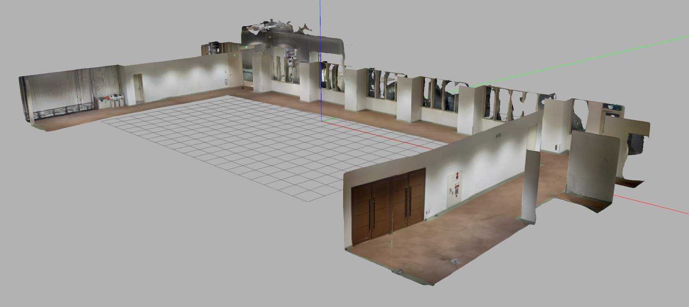

# realworld_sim



*ScaniverseのLiDARスキャンから構築したGazebo Classic環境の全景。*

ScaniverseのLiDARスキャンから作成した、大学屋内環境のROS 1 / Gazebo Classic用シミュレータです。TurtleBot3 Burger、ロボット正面カメラ、上空カメラ、ゲームパッド操作を含みます。

## 動作環境

- Ubuntu 20.04
- ROS 1 Noetic
- Gazebo Classic 11
- TurtleBot3 Burger

## 主なROSトピック

| 用途 | トピック |
|---|---|
| 速度指令 | `/cmd_vel` |
| 正面カメラ | `/tb3/front_camera/image_raw` |
| 正面カメラ情報 | `/tb3/front_camera/camera_info` |
| 上空カメラ | `/top_down/camera/image_raw` |
| 上空カメラ情報 | `/top_down/camera/camera_info` |
| 3眼カメラ（左） | `/camera_left/rgb/image_raw` |
| 3眼カメラ（中央） | `/camera/rgb/image_raw` |
| 3眼カメラ（右） | `/camera_right/rgb/image_raw` |

## インストール

ROS Noeticを導入済みのUbuntu 20.04で、必要なパッケージをインストールします。

```bash
sudo apt update
sudo apt install \
  git \
  ros-noetic-gazebo-ros-pkgs \
  ros-noetic-joy \
  ros-noetic-teleop-twist-joy \
  ros-noetic-turtlebot3-description \
  ros-noetic-turtlebot3-gazebo \
  ros-noetic-xacro
```

Catkinワークスペースへクローンしてビルドします。

```bash
mkdir -p ~/catkin_ws/src
cd ~/catkin_ws/src
git clone https://github.com/Yoshino0304/realworld_sim.git
cd ~/catkin_ws
catkin_make
source devel/setup.bash
```

## シミュレータの起動

```bash
source /opt/ros/noetic/setup.bash
source ~/catkin_ws/devel/setup.bash
roslaunch realworld_sim scaniverse_tb3.launch
```

TurtleBot3 Burgerは床上の安全な初期位置に生成されます。

## GRAPHT Omni Plusで操作

コントローラー背面をPCモードにしてUSBレシーバーを接続し、デバイス番号を確認します。

```bash
ls -l /dev/input/js*
```

既定値は `/dev/input/js1` です。左上ショルダーボタンを押しながら、左スティック上下で前後進、右スティック左右で旋回します。

```bash
roslaunch realworld_sim teleop_omni_plus.launch
```

番号が異なる場合は起動引数で指定します。

```bash
roslaunch realworld_sim teleop_omni_plus.launch joy_dev:=/dev/input/js0
```

## キーボードで操作

```bash
rosrun turtlebot3_teleop turtlebot3_teleop_key
```

## カメラ画像の確認

```bash
rqt_image_view /tb3/front_camera/image_raw
```

またはImage Viewのプルダウンから `/top_down/camera/image_raw` を選択します。

## ディレクトリ構成

```text
config/   ゲームパッド設定
launch/   Gazebo・TurtleBot3・テレオペの起動ファイル
meshes/   Gazebo表示用OBJ、MTL、テクスチャ
models/   Gazeboモデル定義と衝突形状
urdf/     正面カメラ付きTurtleBot3 Burger
worlds/   Gazeboワールドと上空カメラ
```

`raw/` のScaniverse原本と `blender/` の作業ファイルは、実行には不要なためリポジトリへ含めません。

## シミュレーション上の処理

- 表示にはテクスチャ付きスキャンメッシュを使用
- 走行面にはマップ全域を覆う平坦なBox衝突を使用
- 壁・柱・階段にはスキャンメッシュの衝突を使用
- スキャンが不安定な傘立てには単純化した補助Box衝突を使用

## ライセンス

コードと設定ファイルはMIT Licenseです。スキャン由来のメッシュとテクスチャを再利用する場合は、施設管理者・権利者のルールにも従ってください。
